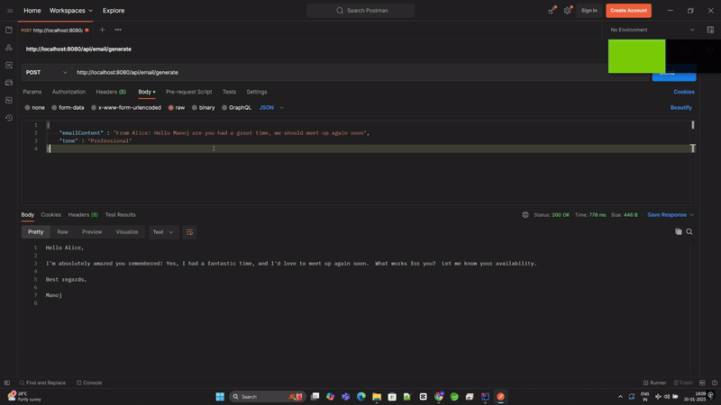

# AI-Powered Email Assistant

This project is an AI-powered email assistant that uses Google Gemini to generate smart, context-aware email replies. Whether you need quick responses, formal replies, or personalized messages, this tool streamlines your email workflow.

## Features

- **Smart Replies**: Generate quick, context-aware responses.
- **Formal Replies**: Create formal email replies with ease.
- **Personalized Messages**: Customize messages based on the context.
  
## API Demo
  
## Getting Started

### Prerequisites

- Java 11 or higher
- Maven
- Google Gemini API Key

### Installation

1. Clone the repository:
    ```sh
    git clone https://github.com/yourusername/your-repo-name.git
    cd your-repo-name
    ```

2. Configure the Gemini URL and API Key in `application.properties`:
    ```properties
    gemini.api.url=https://api.gemini.com/v1
    gemini.api.key=your_api_key_here
    ```

3. Build the project:
    ```sh
    mvn clean install
    ```

4. Run the application:
    ```sh
    mvn spring-boot:run
    ```

## Endpoints

### 1. Generate Quick Reply

- **URL**: `/api/reply/quick`
- **Method**: `POST`
- **Description**: Generates a quick, context-aware reply.
- **Request Body**:
    ```json
    {
        "emailContent": "string"
    }
    ```
- **Response**:
    ```json
    {
        "reply": "string"
    }
    ```

### 2. Generate Formal Reply

- **URL**: `/api/reply/formal`
- **Method**: `POST`
- **Description**: Generates a formal email reply.
- **Request Body**:
    ```json
    {
        "emailContent": "string"
    }
    ```
- **Response**:
    ```json
    {
        "reply": "string"
    }
    ```

### 3. Generate Personalized Message

- **URL**: `/api/reply/personalized`
- **Method**: `POST`
- **Description**: Generates a personalized message based on the context.
- **Request Body**:
    ```json
    {
        "emailContent": "string",
        "context": "string"
    }
    ```
- **Response**:
    ```json
    {
        "reply": "string"
    }
    ```

## Configuration

To configure the Gemini URL and API Key, update the `application.properties` file with the following properties:

```properties
gemini.api.url=https://api.gemini.com/v1
gemini.api.key=your_api_key_here 
```      

## Contributing
Contributions are welcome! Please open an issue or submit a pull request for any changes.

## 📧 Contact
**LinkedIn** - [ManojNanjundaswamy](https://www.linkedin.com/in/manoj-nanjundaswamy/)  

**Mail** - [manojnanjundaswamy@gmail.com](mailto:manojnanjundaswamy@gmail.com)

**Project Link:** [https://github.com/manojnanjundaswamy/AI_Mail_Assist](https://github.com/manojnanjundaswamy/AI_Mail_Assist)